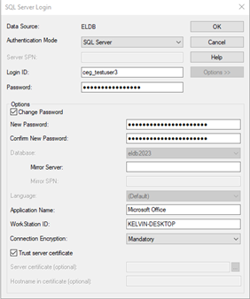

# ELDB Server Password
## Your ELDB Server Username and Password
CEG will provide you with a csv file containing the access and authentication details for the ELDB server. These are the credentials that will need to enter into the application that you use to query the ELDB data (eg SSMS, MS Access, R etc). The csv file will be sent to you separate from the CEG-VPN credentials. These credentials consist of:

- **server address** – this is an internet address setup to link to the ELDB server. It is the primary address to use when setting up a connection.
- **server name** – this is the name of the server used by the hosting service (Amazon Web Services). If there is a problem with the server address, the server name may work instead.
- **server IP** – this is the actual address of the server on the network. If the server address and server name don’t work, the server IP should work. However, the server IP is not static and can change if the server is rebooted during maintenance. It is advisable where possible therefore to use either the server address or name.
- **username** – this is your login specifically for the ELDB server.
- **password** – this is a lengthy set of random characters specific to your username, created by CEG. It does not require changing but you can change it, as described below.

Your password must be stored in a secure location. The recommendation is to use a Password Manager such as BitWarden (<https://bitwarden.com/>) or KeepassXC (<https://keepassxc.org/>).

## Changing Your ELDB Password
CEG will provide you with a strong password for the ELDB Server. Previously, the requirement was for this to changed on first login. This caused problems for some users attempting to connect with applications that didn’t have password management facilities. The policy has changed, therefore, to using complex static passwords. However, users are able to change this password to one more suitable for their specific needs, or if they believe the password may have been compromised.

The user generated password must:

- be unique to the ELDB Server login.
- be at least 12 characters.
- be at least 4 words long, if created using a passphrase or diceware system.
- have a calculated entropy of 60+

Password generators are available online, including:
<https://rumkin.com/tools/password/>
<https://diceware.dmuth.org/>

### Changing your Password using SQL
This is the simplest method, if you have an [SQL client](Connect_SQL_Clients.md) (SSMS, ADS, DBeaver etc) that is connected to the ELDB Server. Even if you don’t use SQL for data querying, it may be useful to have a SQL client connection specifically for this purpose.

In the SQL client, create a new query and enter:
```sql
ALTER LOGIN <username>;
WITH PASSWORD = '<new password>'
OLD_PASSWORD = '<old password>'
```
Note the single quotes around the new and old passwords. Run the query and check that no error messages are returned.
You will need to separately change any connection details in your applications to the new password.

### Changing your Password using MS Access
This method requires that you have an [ODBC DSN](Connect_ODBC_DSN.md) set up for the ELDB Server for use in [Microsoft Access](Connect_MS_Access.md).

- Create a new Access database and proceed in the same way as instructed below for linking ELDB tables to Access:
- Select to connect to a SQL Server or an ODBC data source.
- Select *Link the data source by creating a linked table* and select the DSN that you created for the ELDB Server under the Machine Data Source tab.
{align=left}    
- In the SQL Server Login Pop Up, enter your old (or current) password and click _Options >>_ to display the additional settings.
- Confirm that Database refers the right database.
- Tick *Change Password* and provide a new password
- Click OK and then OK to close the *Link Tables* window. OK and Close any still open windows and then the Access database.

Your password will have now been changed on the server and so can be used or changed in any other Access databases or applications you use.

### Change your Password in SQLCMD
This is another simple method, if you have SQLCMD installed on your device.

- Open a Command Prompt or PowerShell and type:
```bash
sqlcmd -S eldb.qmul-ceg.net -U <username> -P <password> -Z <new password>
```
- Press enter to run the command. If there are no problems, the cursor will open a new line as 1>. Type exit to leave the utility.