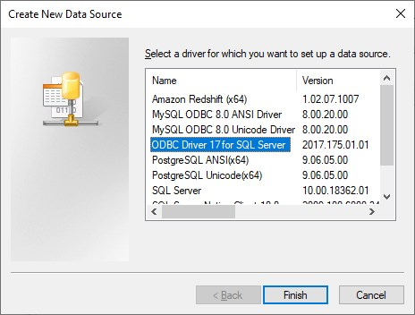
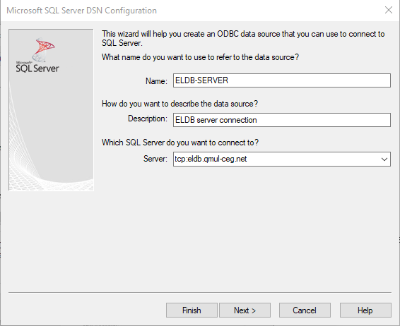
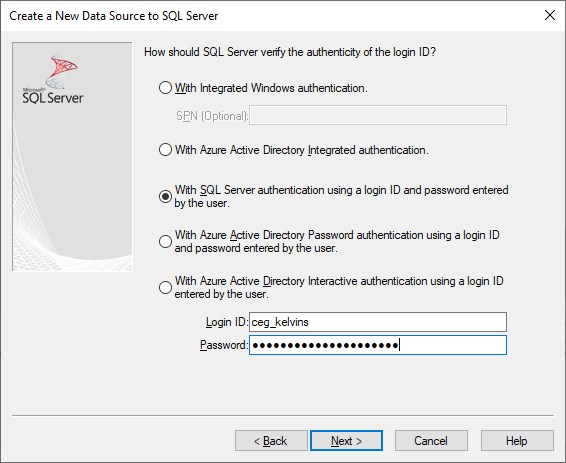
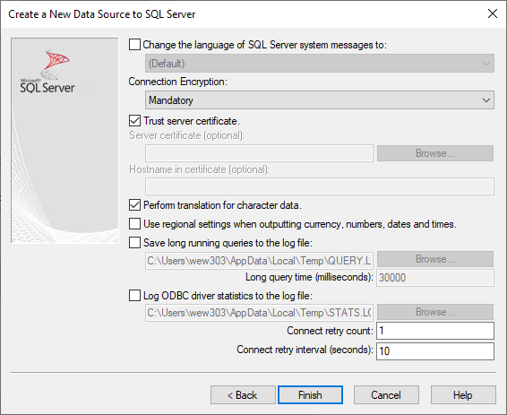
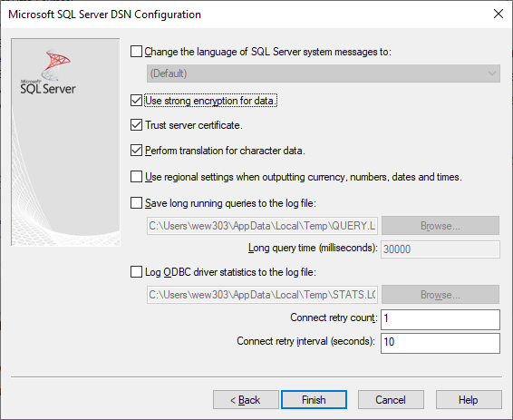
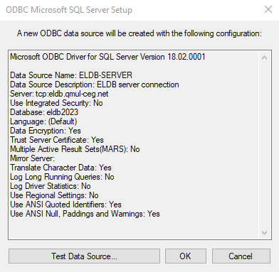

# ODBC Driver & DSN

A Data Source Name (DSN) holds the connection information required for a data client on Windows to connect with a data source – in this case the ELDB Server. It specifies the ODBC driver to use and the server address. Both MS Access and Power Query (Excel and Power BI) use a DSN to connect to the ELDB server.

**Note:** The DSN specifies the connection to the server. The same DSN can be reused in different applications and instances of an application that links to differing databases on the server. (ie MS Access files setup for differing ELDB databases can use the same DSN, amended within the MS Access instance to link to a specified database).

## Install the ODBC Driver for SQL Server

The _ODBC Driver for SQL Server_ enables applications to connect and query data on a SQL Server. To check if it is installed on your PC:

Open the **ODBC Data Source Administrator (64-bit)** App by either

- _Control Panel > Administrative Tools > OBDC Data Source Administrator (64-bit)_
- _Programs > Windows Administrative Tools > OBDC Data Source Administrator (64-bit)_
- Search for _ODBC > OBDC Data Source Administrator (64-bit)_

Select the **Drivers** tab and look in the list for _ODBC Driver \[xx\] for SQL Server_

If it is not listed, download and install the ODBC driver from:

<https://learn.microsoft.com/en-us/sql/connect/odbc/download-odbc-driver-for-sql-server>

## Set up a User DSN

A \[Machine\] User DSN stores the connection information in the Windows Registry of the computer making it only available to the creating user and not able to be copied for one PC to another. For these reasons, it is best to set up a User DSN, rather than a System or File DSN.

In the ODBC Data Source Administrator (64-bit) app select the User DSN tab.

Click Add and in the Pop Up choose the ODBC Driver \[xx\] for SQL Server and click Finish.

In the new Pop Up, add the following information:

Name: ELDB Server

Description: ELDB Server connection

Server: tcp:eldb.qmul-ceg.net

Click **Next**

In the next screen, select **With SQL Server authentication using a login ID…** and enter your login ID and password.

Click **Next**.

For the next few screens, ODBC Driver 18 for SQL Server has a slightly different setup to ODBC Driver 17 for SQL Server and earlier. Please follow the appropriate instructions.

> [!note]- ODBC Driver 18 for SQL Server
> 
> Click **Next**.
> Click **Next** again to move on 2 screens.
> Tick Trust server certificate
> 
> Click **Back** to navigate to the previous screen.
> **Change the default database to** the most recent ELDB database or the one you usually connect to eg eldb2023. You will get a list of databases present on the ELDB server to choose from. Ignore any databases with suffixes (eg eldb2020_DEV) and any other non ‘eldb’ database names.
> Note: this is the default database for the DSN. Other databases can be specified where it is used in an application.
> Change the Application intent to READONLY.
> 
> Click **Next** to return to the Trust server screen.
> Click **Finish**.

> [!note]- ODBC Driver 17 for SQL Server and earlier
>
> Click **Next**.
> **Change the default database to** the most recent ELDB database or the one you usually connect to eg eldb2023. Will get a list of databases present on the ELDB server to choose from. Ignore any databases with suffixes (eg eldb2020_DEV) and any other non ‘eldb’ database names. Change the **Application intent** to **READONLY**
> 
> Click **Next**.
> Tick Use strong encryption for data and Trust server certificate
> 
> Click **Finish**.

## Check the Connection

For either Driver version, you should now reach a preview of the DSN configuration.

Click Test Data Source.

If the connection fails, check back through the settings and re-enter your password – the password needs re-entering every time the DSN is edited or reviewed.

Once the Test works, Click **OK**.

The newly created DSN should be listed in the User DSN list.

Click **OK** to close the window.