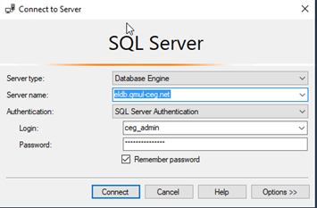
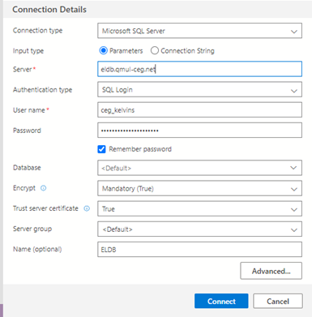
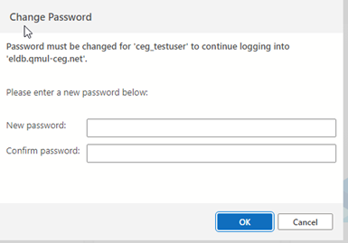
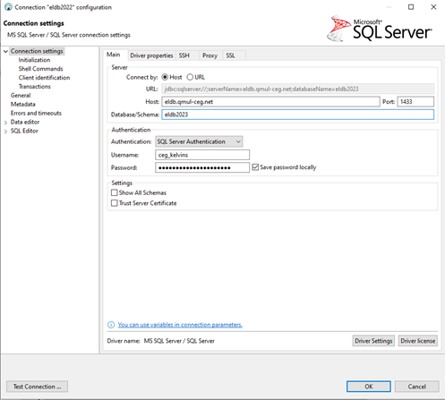

# SQL Clients

The ELDB Server can be accessed directly using any SQL client software with capabilities for connect to Microsoft SQL Server. 

## SQL Server Management Studio (SSMS)
SQL Server Management Studio (SSMS) is the SQL client provided by Microsoft. It can be downloaded for free from [Microsoft](<https://docs.microsoft.com/en-us/sql/ssms/download-sql-server-management-studio-ssms?view=sql-server-ver15>).

All required drivers are installed with the application. A DSN is NOT required.

Open SSMS and select *Connect Object Explorer…* from either the File menu or the  icon at the top of the Object Explorer panel. A login window will appear. Enter the ELDB access credentials that you have been given and click *Connect*.

## Visual Studio Code (VSCode)
[Visual Studio Code (VSCode)](https://code.visualstudio.com/) is Microsoft's open-source Code Editor that uses Extensions to support a large range of programs, connections and activities.  The SQL Server extension enables VSCode to connect and query MSSQL. No DSN setup is required and VSCode installs without requiring admin rights. The guide below is for Azure Data Studio, but the Visual Studio Code extension has a very similar interface.
## Azure Data Studio (ADS)
Azure Data Studio is an open-source SQL client developed by Microsoft from the VSCode SQL Server extension.  However, Microsoft are retiring Azure Data Studio **Feb 28th 2026** in favour of the Visual Studio Code extension. More details [here](https://learn.microsoft.com/en-us/azure-data-studio/whats-happening-azure-data-studio).

Open ADS and select the top icon, *Connections*, from the lefthand sidebar. This will open the Connections panel. At the top of this panel, click on the left-hand icon (circled in red below) to create a *New Connection*.

The Connection panel will open on the right-hand side with the Connection Details section at the bottom.

- Change the *Authentication type* to ‘SQL Login’ and enter the ELDB credentials that you have been given in the *Server*, *User name* and _Password* sections. Tick *Remember password*.
- *Database* can be set to a specific database, such as ‘eldb2024’ – this will set the connection to that specific database. Alternatively, *Database* can be left as ‘Default’ – this will set the connection to ELDB server, allowing you to see all the databases on the server. You will only be able to access, however, the databases to which you have been given the relevant permissions. See below for screenshots.
- Change *Trust server certificate* to ‘True’.
- Provide a suitable name for the connection in the *Name(optional)* section.
- Click *Connect*

If your password needs changing, the Change Password box will appear when you press *Connect* or when you select the *Database*. Choose a new password and *OK*. 

If you get a 'Connection error' warning, click *Enable trust server certificate*. This will set the *Trust server certificate* section in the Connection Details to ‘True’.

 
As explained above, connections using *Default* will display all the databases on the server. Connections made to a specific database will show just that database. You can set up multiple connections, of either type, and group them in the Connections panel. Below, each ELDB database has a separate connection under a ‘ELDB’ group.

Whereas a 'Default' connection displays all the available databases on the server.  In each case, the database expands to a list of schemas and system folders. The database tables can be found under the `dbo` schema.

## DBeaver and Other SQL Clients

DBeaver is a SQL client that can connect to many different types of database. The free Community version is available from <https://dbeaver.io> and a portable version, that does not require an administrative login, can be downloaded from <https://portapps.io/app/dbeaver-portable/>. Other SQL clients can be used and will follow a similar connection process.

Open a connection wizard by clicking on the plug icon in the upper left corner of the application window or go to *Database >> New Database Connection*. The database selection window will open with a long list of database connections. Select *SQL Server* and click Next.

Enter your ELDB access credentials, including your newly created password. Click Finish.

]

DBeaver will assess the connection requirements and may request that a JDBC driver is installed. Click *OK* and the driver will be automatically downloaded and installed.
