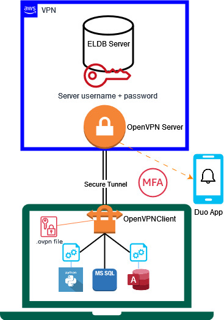

# Overview
The East London Database is a series of annual databases containing data from the 1st April for patients registered with GP practices on that date. Full details of the included tables, the build business logic and commentary on how the data can be used are provided in a ‘Data and Schema’ document for the specific database. This guide provides information for connecting to the ELDB Server and to specific ELDB databases in order to conduct analyses.

## ELDB Server
The ELDB databases sit on the ELDB Server (Microsoft SQL Server), which is accessed by a username and password. This will be entered into the application you are using to connect to the server in order to query the data. See below.

## CEG VPN
The ELDB server is secured inside a Virtual Private Network (VPN) which can only be accessed via an OpenVPN server. User must have an OpenVPN client installed on their laptop or PC in order to establish the secure tunnel between their device and into the VPN. The VPN connection is authenticated by a confirmed notification from the Duo Mobile service. Users must also have, therefore, a Duo Mobile app installed on their smart phone. Together, these two authorisations create Multi Factor Authorisation (MFA).

In summary, users are authorised to access the VPN by 2 authorisations:
1. A personal .ovpn file containing the user’s personal key which authorises the device to connect to the OpenVPN server.
2. A confirmed Duo notification on the user’s smart phone.

## ELDB Sever Connection
Once a connection has been made into the VPN, the user connects to the ELDB Server using any application they choose that is capable of connecting to Microsoft SQL Server. They will need to provide their ELDB Server username and password where required, in order for the application to log into the server.

Some applications can query the SQL data directly, but many others need additional drivers or applications, such as ODBC drivers, to translate commands and queries. For many Microsoft applications, such as MS Access, it is necessary to install a special driver and setup a Data Source Name (DSN) within which to store the connection details.

## ELDB Query Software
The main applications that can be used to access the ELDB data are:
### Microsoft Access
Allows links to ELDB tables. Query using GUI. Requires:
  - ODBC driver
  - Setting up a User ODBC DSN
  - Running a VBA script, provided by CEG.
### Azure Data Studio
Enables a direct connection to the ELDB server and databases. Query using T-SQL.
### SQL Server Management Studio
Enables a direct connection to ELDB server and databases. Query using T-SQL.
### SQL DBeave
Enables a direct connection to ELDB server and databases. Query using T-SQL. Requires:
  - JDBC driver – automatically installed
### Power Query
Available as standard within Microsoft Excel and Power BI. Allows links to individual ELDB tables. Query using GUI and M (Power Query language). Requires:
  - ODBC driver
  - Setting up a User ODBC DSN
### SQLCMD Utility
The SQL Server Command Line Tool. This is bundled with the ODBC for SQL Server driver or can be downloaded separately. Enables a direct connection to an SQL Server using commands in the Command Prompt or PowerShell. This can be useful for managing a SQL Server password, as this facility is not readily available in MS Access, Power Query or DBeaver.

## The 4 Step Setup
The process for connecting to ELDB should be understood therefore as 4 steps:
1. Setup applications for using the CEG VPN
    a. Install OpenVPN Client on laptop/PC
    b. Install Duo Mobile App on smart phone
2. Connect to CEG VPN
    a. Install ovpn key file
    b. Connect OpenVPN Client + Authorise Duo notification
3. Setup applications for querying the data
    a. Install preferred client, eg SSMS, MS Access, ADS
    b. If required install and setup additional drivers
4. Connect to an ELDB database
    a. Open application and enter username and password as required

This process can require a lot of software installation. As CEG does not manage or know about user’s particular hardware, network or other installed software, there is a limit to the amount of support CEG can provide for this process or for resolving problems. In many cases, installation issues will need to be handle by the device’s user or administrator. CEG can help with connection issues to the VPN and to the ELDB server.